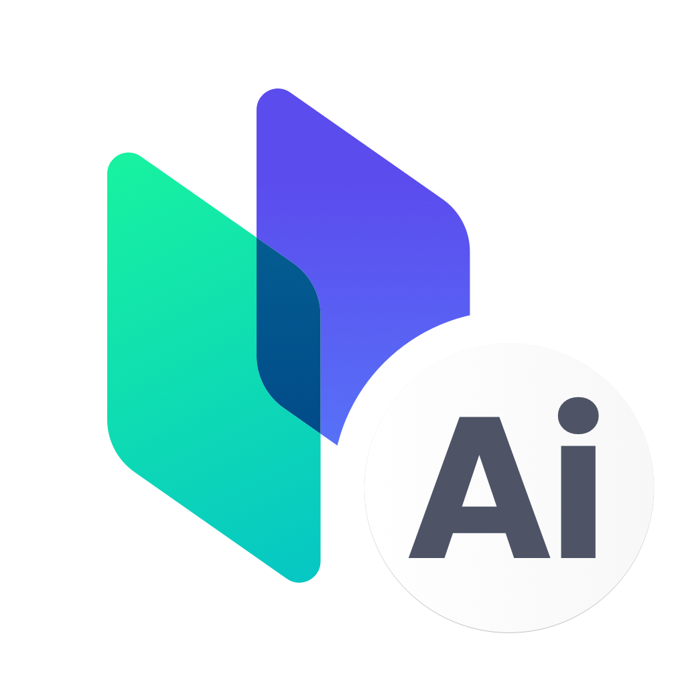
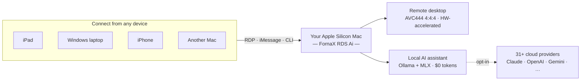

# FornaX RDS Ai

### A production-grade native RDP server for macOS — with a built-in on-device AI assistant.

**Your Mac, from anywhere. Your AI, going nowhere.**

Turn any Apple Silicon Mac into a private AI server **and** a full-quality remote desktop — run any local model, reach it from any device, and pay **$0 per token**.

### ⭐ Star this repo to get notified the moment the binary drops on **July 1, 2026**.

<!-- HERO IMAGE (add later): drop a 1280×640 banner into assets/screenshots/ and uncomment:
 

-->

---

> **🗓️ Launching July 1, 2026** — the first public binary (signed & notarized PKG) will be released here on **2026-07-01**. **Watch / Star this repo** to get notified on release day. Source code is not published; FornaX RDS Ai is distributed as a signed binary.

## What makes FornaX RDS Ai different

1. **One product that is both a remote desktop and an on-device AI assistant.** This is the part nothing else does — no remote desktop, open source or commercial, on any OS, ships with a built-in local-AI assistant. It's the heart of FornaX RDS Ai.
2. **A polished, signed, supported RDP server — not a build-it-yourself project.** A few experimental macOS RDP servers exist on GitHub, but they're source-only projects you compile yourself. FornaX RDS Ai is a signed, notarized, installable product with ongoing updates and support.
3. **Full-color AVC444 / AVC444v2 (YUV 4:4:4) quality.** Pixel-accurate color and razor-sharp text — a difference you can verify yourself in 30 seconds.

Plus one more thing: with both **Ollama** and **Rapid-MLX** engines built in, FornaX RDS Ai is effectively **an open door to the entire local-model ecosystem**. Run virtually any open model — Llama, Qwen, Gemma, DeepSeek, Mistral, Phi and the rest — on your own Mac, and choose the engine that fits each model: Ollama for its broad library, MLX for Apple Silicon–native execution. Try every model, keep the ones you like, pay nothing per token.

## What is FornaX RDS Ai?

FornaX RDS Ai is a **remote desktop (RDP) server + built-in AI assistant platform for macOS**, built by [GlooVir](https://gloovir.com).

One install, two ways to use your Mac:

1. **Use your Mac's full power from anywhere** — connect from any standard RDP client (Windows, iPad, phone, another Mac) and use your Mac's CPU, GPU, and apps remotely, with full-color 4:4:4 image quality and hardware-accelerated low-latency streaming. No new client software to install.
2. **A personal AI service — even when you never connect remotely** — local LLMs run directly on Apple Silicon inside FornaX RDS Ai. Sitting at your Mac, texting it via iMessage, or connected over RDP, you get an unlimited private AI assistant with **no monthly subscription and no token billing**.

| | |
|---|---|
| **4:4:4** | Full-color AVC444/AVC444v2 — crisp text, accurate colors, verifiable in 30 seconds |
| **−80% CPU** | VideoToolbox HEVC/H.264 hardware encoding, zero-copy capture, adaptive bitrate |
| **Any local model** | Ollama + Rapid-MLX engines built in — run any open model on your Mac; 31+ cloud providers optional |
| **$0 token cost** | On-device AI: unlimited use, your data never leaves your Mac |

## How it works

Your Mac does all the heavy lifting — remote desktop streaming **and** local AI inference. Lightweight devices just connect in; your data and your models stay on the machine.

## Your Mac Studio's power — on your iPad, from anywhere

<!-- SCREENSHOT (add later): iPad/Windows showing the full remote Mac desktop — then uncomment:

-->

A Mac Mini or Mac Studio is a serious workstation. FornaX RDS Ai turns it into one you can reach from almost anything with a standard RDP client — an **iPad** on the couch, a **Windows** laptop at a client site, a phone on the road. Heavy builds, video renders, and large local AI models all run on the powerful Mac sitting at home or in the office; your lightweight device just displays the result in full 4:4:4 color, at low latency.

**The horsepower stays put. You go anywhere.** Buy compute once, use it from every screen you own — no per-device licenses, no syncing files back and forth, no cloud rental for the heavy lifting.

## In practice

- **On the train, from your phone:** text your Mac over iMessage — *"summarize today's meeting notes and draft a reply"* — and it's done before you arrive, processed entirely on your Mac.
- **At your desk, hands-free:** speak to it. Whisper transcribes, a local model answers out loud, your files never leave the machine.
- **Away from the office:** open any RDP client and your full Mac is right there in pixel-accurate color — edit, render, present as if you were sitting in front of it.

One app does all of this. Nothing to wire together, no cloud account required to start.

<!-- DEMO GIF (add later): iMessage → Mac AI reply, short (<6s, <5MB) — then uncomment:

-->

## Simple to set up

1. **Install** the signed, notarized PKG — double-click, done.
2. **Grant** screen and accessibility permissions once.
3. **Pick a model** from the in-app manager (or bring your own API key) and start chatting, speaking, or connecting.

No servers to configure, no Docker, no command line. If you can install a Mac app, you can run FornaX RDS Ai.

## Is there anything else like this?

We looked. A few projects do parts of this — but nothing combines all three, and nothing pairs a remote desktop with a built-in on-device AI assistant.

| | Mac-native **RDP server** | 4:4:4 full-color codec | Built-in **AI assistant** (local LLM) |
|---|:---:|:---:|:---:|
| **FornaX RDS Ai** | ✅ | ✅ AVC444/v2 | ✅ local + 31+ cloud providers |
| xrdp (open source) | ❌ Linux only — macOS port is an unofficial WIP | ❌ | ❌ |
| RustDesk / Sunshine (open source) | ❌ own protocols, not RDP | ❌ | ❌ |
| Apple Screen Sharing | ❌ proprietary, Mac-to-Mac client only | — | ❌ |
| Windows RDP (for comparison) | Windows only | ✅ | ❌ |

## Who it's for

| You are a... | What FornaX RDS Ai gives you |
|---|---|
| 👩‍💻 **Developer** | An unlimited private coding assistant **and** an OpenAI/Anthropic-compatible local API for Claude Code, Cursor, and Aider — your code never leaves the Mac |
| 🎨 **Designer / creative** | 4:4:4 pixel-accurate color over remote — edit and review from an iPad with no chroma blur |
| 💼 **Everyday Mac user** | A voice assistant you can reach from iMessage — summarize, schedule, and reply, hands-free |
| 🏢 **Team / enterprise** | On-prem AI for every Mac: zero data egress, no per-seat LLM fees, MDM-deployable |

## Features

### Remote Desktop

<!-- SCREENSHOT (add later): side-by-side text/color close-up, AVC444 vs 4:2:0 — then uncomment:

-->

- Full-color **AVC444 / AVC444v2 (YUV 4:4:4)** streaming — no chroma blur on text and UI
- **Apple Silicon acceleration**: VideoToolbox **HEVC/H.264** hardware encoding (~80% lower CPU), zero-copy capture, adaptive bitrate — low-power and low-latency
- Modern **ScreenCaptureKit** capture, multi-monitor, audio redirection, concurrent sessions
- Works with standard RDP clients (Windows App / Microsoft Remote Desktop, etc.)

### AI Assistant

<!-- SCREENSHOT (add later): in-app AI chat + model manager — then uncomment:

-->

- **Run any local model, your choice of engine**: both **Ollama** and **Rapid-MLX (MLX)** engines are built in, so the entire open-model ecosystem is at your fingertips — Llama, Qwen, Gemma, DeepSeek, Mistral, Phi and more. Browse, download, and switch models in-app, and pick the engine that suits each model — Ollama for its broad model library, MLX for Apple Silicon–native execution. Zero token cost, full privacy
- **Always current — monthly model & feature updates**: we ship **new models and features every month**, so the latest releases and improvements show up ready to use without waiting
- **Developer-ready API**: exposes an **OpenAI- and Anthropic-compatible local endpoint** so tools like Claude Code, Cursor, and Aider can run against your Mac's local models
- **Cloud when you want it**: 31+ providers selectable per task, including **Ensemble** mode that compares and synthesizes multiple AIs for a better answer
- **Voice**: Whisper speech-to-text and spoken replies (TTS), in Korean, English, or Japanese
- **Multi-channel**: talk to your Mac's AI from **RDP, iMessage, or CLI** — e.g. text it from your phone and it summarizes a document, books your calendar, and replies
- **Agent capabilities**: knowledge base (RAG), persistent memory, automation & event hooks, scheduled runs; the agent asks you before acting when something is ambiguous
- Chat conveniences: `/compact`, `/queue`, `/steer`, custom system prompts, project rule files
- **Built-in model manager**: download local LLM and embedding (RAG) models with progress/speed/ETA, recommended models with estimated speeds, one-click Ollama setup
- **Usage & cost dashboard**: per-provider token usage and spend at a glance, one-click jump to each provider's console and API-key page

### App Experience
- Fully localized app UI in **Korean and English**, switchable in settings
- On update or uninstall, **choose to keep your data** (API keys, conversations, memory, knowledge base) — reinstall and pick up where you left off

### Privacy & Security
- On-device AI execution — conversations, memory, and knowledge base stay on your Mac
- **Developer ID–signed** binaries with permission-gated automation
- Privacy controls including auto-deletion of chat history

## Why local AI?

| | Typical cloud LLM subscription | FornaX RDS Ai · Local AI |
|---|---|---|
| Cost | $20–hundreds per month + token billing | **$0 token cost, unlimited** |
| Data | Sent to external servers | **Never leaves your Mac** |
| Models | Vendor lock-in | **31+ providers, your choice** |

Developers get an unlimited coding assistant that never exfiltrates company code. Everyone else gets a daily assistant for summaries, scheduling, and messages — by voice if you like.

## Built for AI development on Mac

FornaX RDS Ai turns any Apple Silicon Mac into a private AI workstation and a local AI server for development:

- **OpenAI- and Anthropic-compatible local API** — point **Claude Code, Cursor, Aider**, or any OpenAI-compatible app at your Mac and run them against local models. A drop-in local replacement for cloud APIs, at $0 token cost.
- **Run local LLMs with Ollama and MLX** — Llama, Qwen, Gemma, DeepSeek, Mistral, Phi and more, **on-device and offline** on Apple Silicon.
- **Build and serve** — prototype AI apps, power a coding assistant, run a private **RAG** knowledge base, or stand up an internal AI service that never sends data off the machine.
- **Develop from anywhere** — work on an **iPad or Windows** laptop while a powerful **Mac Mini / Mac Studio** does the actual inference, over standard RDP.

> A private, self-hosted, offline AI stack on your own hardware — local LLM, on-device inference, and a remote desktop, in one app.

## For Enterprise — full AI capability for your Mac users, entirely on-premises

For organizations, FornaX RDS Ai means every Mac in the company can deliver a **complete AI service to its user with nothing leaving the building**.

- **Zero data egress by default**: AI runs on each employee's Mac. Internal code, documents, and conversations are never sent to external AI providers — a compliance answer, not just a privacy feature
- **No per-seat AI subscription**: local LLMs eliminate recurring per-user LLM costs across the fleet; cloud providers remain an opt-in, per-task choice under your policy
- **One install, two capabilities**: the same package gives employees a private AI assistant *and* secure full-quality remote access to their office Mac for hybrid work — over standard RDP, no new client software to deploy
- **Manageable & verifiable**: signed and notarized PKG for MDM distribution, permission-gated automation, and a published network-behavior transparency document so your security team can verify what the software does
- **Sensitive-industry fit**: ideal where cloud AI is restricted or prohibited — finance, legal, healthcare, defense, R&D

> Sufficient is the wrong word — for most everyday workloads (coding assistance, document summarization, drafting, voice transcription), **on-device AI on Apple Silicon is not a compromise; it's the more secure default**. Cloud models stay available for the rare tasks that need them.

## Honest by design — strengths, limits, and our commitment

We want you to know exactly what you're getting. Here is our candid assessment — both sides.

**What we believe we do better than anyone:**

- The only remote desktop — on any platform — with a built-in on-device AI assistant
- A polished, signed, and supported native RDP server for macOS, where other options are source-only projects you build yourself
- Genuine 4:4:4 full-color streaming with Apple Silicon hardware acceleration — quality you can verify yourself in 30 seconds

**What we're honest about, and how we'll address it:**

| We know that... | Our commitment |
|---|---|
| A closed-source binary that requests screen, input, and iMessage permissions demands a high level of trust | Every release is **Developer ID–signed and notarized** with SHA256 checksums. We will publish a network-behavior transparency document, and your AI data verifiably never leaves your Mac |
| macOS updates can change capture and permission behavior | We track every macOS beta and commit to **compatibility updates before public OS releases** |
| We're a new product competing with mature remote desktop tools | We ship **user-driven continuous updates** — your Issues and Discussions directly shape each release, and every version's changelog is published here |
| AI features evolve fast | We ship **new models and features every month**, so the newest models and improvements are ready to use shortly after release — alongside continuous updates to providers and agent capabilities |

This is not a "release and forget" product. **The roadmap below is a promise, and this repository is where we keep it.**

## Requirements

- macOS 15 (Sequoia) or later
- **Apple Silicon Mac only** (Intel Macs are not supported)

## Roadmap

- [x] Product introduction (this page)
- [ ] **2026-07-01 — First public binary release** (PKG installer, signed & notarized)
- [ ] Documentation & quick-start guide (with release)
- [ ] Per-version changelogs published with every release
- [ ] Network-behavior & privacy transparency document
- [ ] New AI models and features shipped every month
- [ ] Continuous updates driven by user feedback (Issues / Discussions open from day one)

## License & Distribution

FornaX RDS Ai is **proprietary software distributed in binary form**. Source code is not published. License terms (EULA) will be included with the first binary release.

## Contact

- Website: [gloovir.com](https://gloovir.com)
- Inquiries: contact@gloovir.com

---

© GlooVir Inc. All rights reserved. FornaX, FornaX RDS Ai are trademarks of GlooVir.

