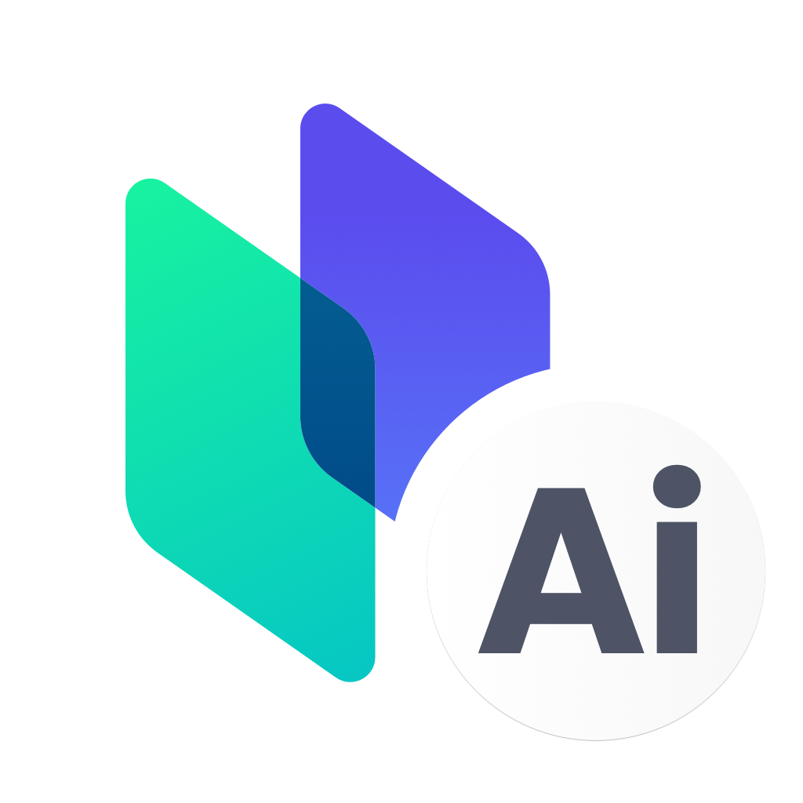

# FornaX RDS Ai

### A production-grade native RDP server for macOS — with a built-in on-device AI assistant.

**Your Mac, from anywhere. Your AI, going nowhere.**

<!-- HERO IMAGE (add later): drop a 1280×640 banner into assets/screenshots/ and uncomment:
 

-->

---

> **⬇️ Available now.** FornaX RDS Ai ships as a signed & notarized PKG. To download, open the [**product page**](https://www.gloovir.com/products/fornax-rds-ai) and enter your **promotion key** — you'll receive an instant download link, no demo request required.
>
> **Promotion key:** `FornaXRDS-Ai_20260708`
>
> **Watch / Star this repo** for monthly model & feature updates and per-release changelogs. Source code is not published; FornaX RDS Ai is distributed as a signed binary.

## What makes FornaX RDS Ai different

1. **One product that is both a remote desktop and an on-device AI assistant.** This is the part nothing else does — no remote desktop, open source or commercial, on any OS, ships with a built-in local-AI assistant. It's the heart of FornaX RDS Ai.
2. **A polished, signed, supported RDP server — not a build-it-yourself project.** A few experimental macOS RDP servers exist on GitHub, but they're source-only projects you compile yourself. FornaX RDS Ai is a signed, notarized, installable product with ongoing updates and support.
3. **Full-color AVC444 / AVC444v2 (YUV 4:4:4) quality.** Pixel-accurate color and razor-sharp text — a difference you can verify yourself in 30 seconds.

Plus one more thing: with both **Ollama** and **Rapid-MLX** engines built in, FornaX RDS Ai is effectively **an open door to the entire local-model ecosystem**. Run virtually any open model — Llama, Qwen, Gemma, DeepSeek, Mistral, Phi and the rest — on your own Mac, and choose the engine that fits each model: Ollama for its broad library, MLX for Apple Silicon–native execution. Try every model, keep the ones you like, pay nothing per token.

## What is FornaX RDS Ai?

FornaX RDS Ai is a **remote desktop (RDP) server + built-in AI assistant platform for macOS**, built by [GlooVir](https://gloovir.com).

One install, two ways to use your Mac:

1. **Use your Mac's full power from anywhere** — connect from any standard RDP client (Windows, iPad, phone, another Mac) and use your Mac's CPU, GPU, and apps remotely, with full-color 4:4:4 image quality and hardware-accelerated low-latency streaming. No new client software to install.
2. **A personal AI service — even when you never connect remotely** — local LLMs run directly on Apple Silicon inside FornaX RDS Ai. Sitting at your Mac, texting it via iMessage, or connected over RDP, you get an unlimited private AI assistant with **no monthly subscription and no token billing**.

| | |
|---|---|
| **4:4:4** | Full-color AVC444/AVC444v2 — crisp text, accurate colors, verifiable in 30 seconds |
| **−80% CPU** | VideoToolbox HEVC/H.264 hardware encoding, zero-copy capture, adaptive bitrate |
| **Any local model** | Ollama + Rapid-MLX engines built in — run any open model on your Mac; 31+ cloud providers optional |
| **$0 token cost** | On-device AI: unlimited use, your data never leaves your Mac |

## Your Mac Studio's power — on your iPad, from anywhere

<!-- SCREENSHOT (add later): iPad/Windows showing the full remote Mac desktop — then uncomment:

-->

A Mac Mini or Mac Studio is a serious workstation. FornaX RDS Ai turns it into one you can reach from almost anything with a standard RDP client — an **iPad** on the couch, a **Windows** laptop at a client site, a phone on the road. Heavy builds, video renders, and large local AI models all run on the powerful Mac sitting at home or in the office; your lightweight device just displays the result in full 4:4:4 color, at low latency.

**The horsepower stays put. You go anywhere.** Buy compute once, use it from every screen you own — no per-device licenses, no syncing files back and forth, no cloud rental for the heavy lifting.

## In practice

- **On the train, from your phone:** text your Mac over iMessage — *"summarize today's meeting notes and draft a reply"* — and it's done before you arrive, processed entirely on your Mac.
- **At your desk, hands-free:** speak to it. Whisper transcribes, a local model answers out loud, your files never leave the machine.
- **Away from the office:** open any RDP client and your full Mac is right there in pixel-accurate color — edit, render, present as if you were sitting in front of it.

One app does all of this. Nothing to wire together, no cloud account required to start.

<!-- DEMO GIF (add later): iMessage → Mac AI reply, short (<6s, <5MB) — then uncomment:

-->

## Simple to set up

1. **Download** — open the [product page](https://www.gloovir.com/products/fornax-rds-ai), enter your promotion key, and grab the signed PKG (no demo request needed).
2. **Install** the signed, notarized PKG — double-click, done.
3. **Grant** screen and accessibility permissions once.
4. **Pick a model** from the in-app manager (or bring your own API key) and start chatting, speaking, or connecting.

No servers to configure, no Docker, no command line. If you can install a Mac app, you can run FornaX RDS Ai.

## Get FornaX RDS Ai

FornaX RDS Ai is available now as a signed & notarized PKG.

1. Go to the [**product page**](https://www.gloovir.com/products/fornax-rds-ai).
2. Enter your **promotion key** — this replaces the demo request and returns your download link instantly.
3. Download, install, and you're ready to go.

> **Promotion key:** `FornaXRDS-Ai_20260708`

## Is there anything else like this?

We looked. A few projects do parts of this — but nothing combines all three, and nothing pairs a remote desktop with a built-in on-device AI assistant.

| | Mac-native **RDP server** | 4:4:4 full-color codec | Built-in **AI assistant** (local LLM) |
|---|:---:|:---:|:---:|
| **FornaX RDS Ai** | ✅ | ✅ AVC444/v2 | ✅ local + 31+ cloud providers |
| xrdp (open source) | ❌ Linux only — macOS port is an unofficial WIP | ❌ | ❌ |
|
